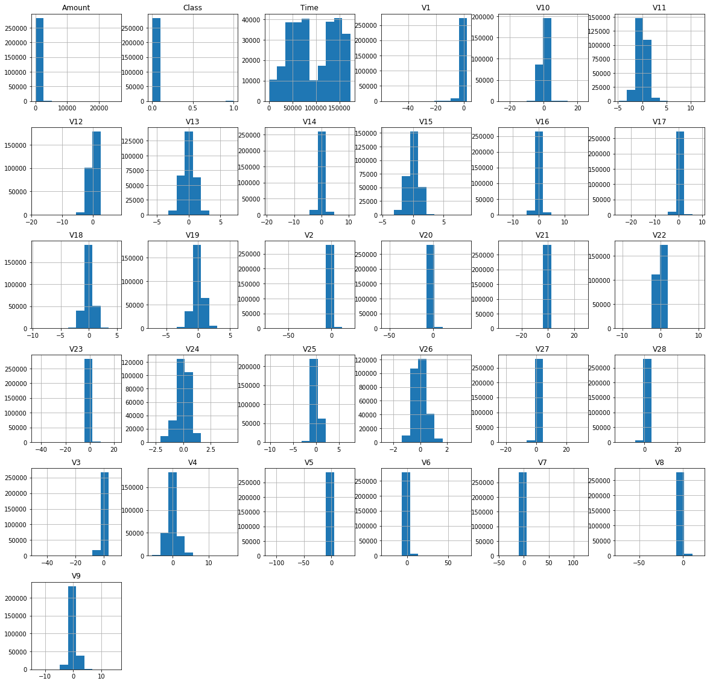
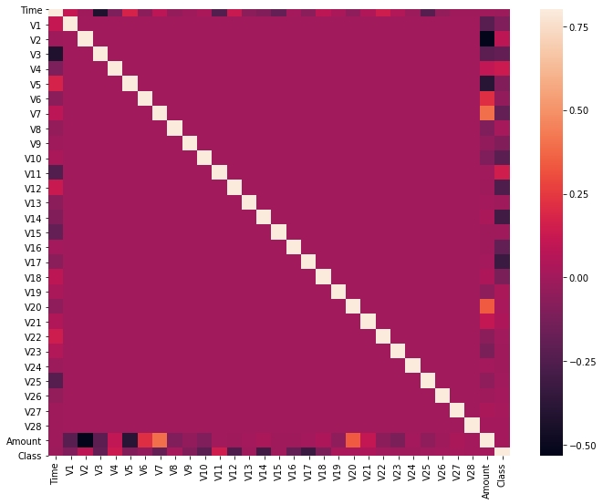

# Credit Card Fraud Detection

*In this project, I have used some machine learning algorithms to detect Credit Card fraudlent transactions. Using a dataset of nearly 285000 credit card transactions and multiple unsupervised anomaly detection algorithms, I am able to identify transactions with a high probability of being credit card fraud.*

***Dataset*** can be found [here](https://www.kaggle.com/mlg-ulb/creditcardfraud)

**I have used the following two machine learning algorithms:**

**1. Local Outlier Factor (LOF)**
The anomaly score of each sample is called Local Outlier Factor. It measures the local deviation of density of a given sample with respect to its neighbors. It is local in that the anomaly score depends on how isolated the object is with respect to the surrounding neighborhood.

**2. Isolation Forest Algorithm**
The IsolationForest ‘isolates’ observations by randomly selecting a feature and then randomly selecting a split value between the maximum and minimum values of the selected feature.

Since recursive partitioning can be represented by a tree structure, the number of splittings required to isolate a sample is equivalent to the path length from the root node to the terminating node.

This path length, averaged over a forest of such random trees, is a measure of normality and our decision function.

Random partitioning produces noticeably shorter paths for anomalies. Hence, when a forest of random trees collectively produce shorter path lengths for particular samples, they are highly likely to be anomalies.

Furthermore, using metrics suchs as precision, recall, and F1-scores,I have investigated  the classification accuracy for these algorithms.

### Plots
- *Plot of histograms of each parameter of the dataset*

---------------------

- *Plot of Correlation matrix*

---------------------

